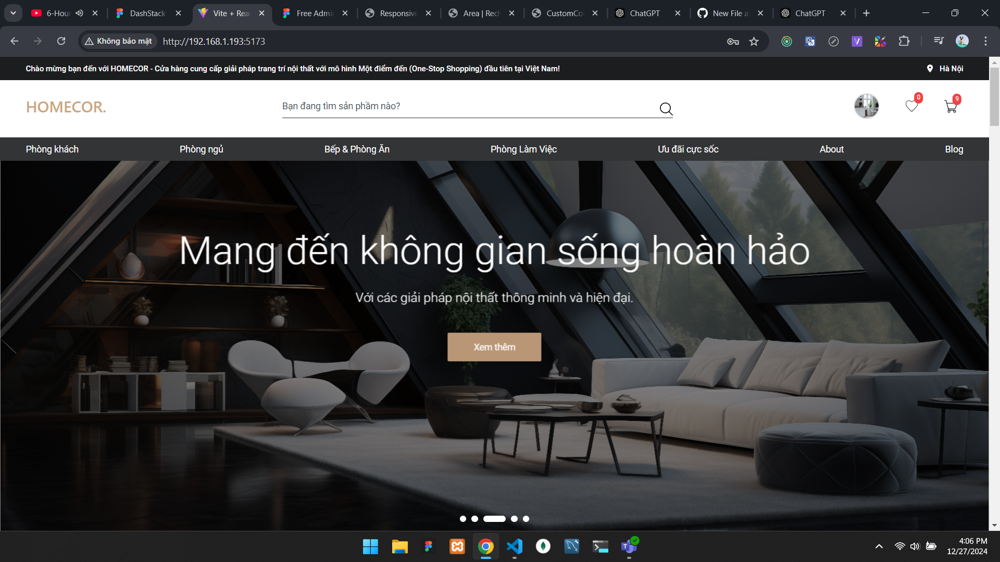
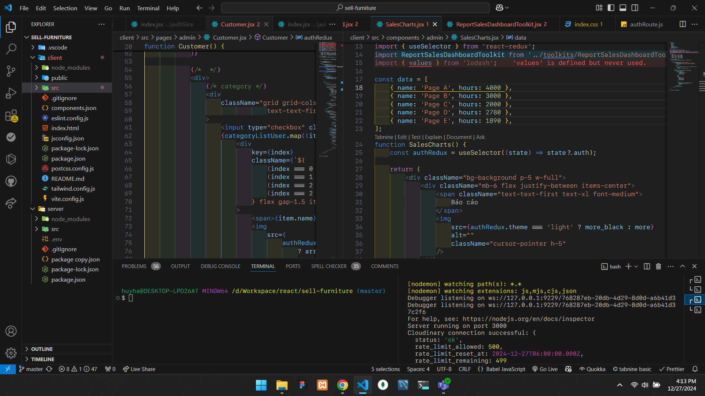
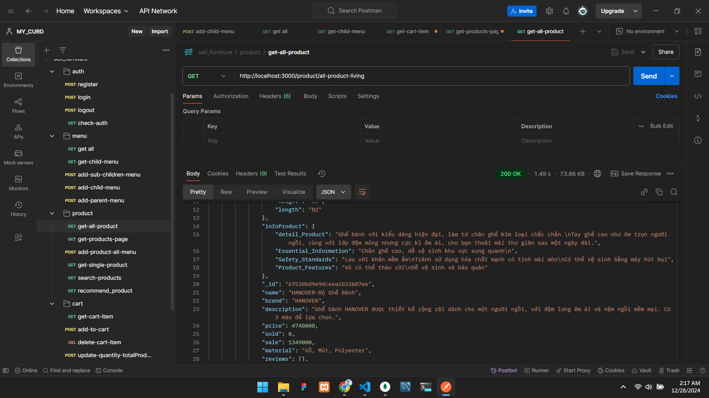

### 1.Project trang web bán đồ nội thất
- Mục tiêu là tạo trang web bán các sản phẩm nột thất (với hơn 100 sản phẩm cao cấp).

### Sử dụng các công nghệ, CSDL:
### Client
- react, redux, tailwind-CSS,...
- Sử dụng Cloudinary để lưu trữ ảnh sản phẩm , ảnh đại diện (số lượng có hạn).

### Server
- Nodejs, Express, mongoose,..., lưu trữ dữ liệu trên mongodb-Sever và postman để test api.
- Jsonwebtoken(JWT) dùng mã hóa 1 vài thông tin người dùng và xác thực, phân quyền người dùng.(thiếu phần refesh token) 
  
### Trang web có các chức năng:
- Reponsive trên nhiều thiết bị.
- Đăng nhập, đăng ký.
- Chỉnh sửa thêm thông tin người dùng, upload avatar, tìm kiếm sản phẩm(chưa hoàn thiện tốt).
- Lọc Sản phẩm (trong phần hiển thị với từng danh mục cụ thể) : Lọc theo màu sắc, lọc theo giá thành, sắp xếp theo giá từ thấp -> cao, từ cao -> thấp.
- Mua hàng: thêm, xóa sản phẩm giỏ hàng(tăng số lượng sp - áp mã giảm giá), sản phẩm yêu thích(thêm - xóa), đơn hàng đã đặt.
- Thanh toán sản phẩm: thanh toán QR-CODE (zalo-chưa được vì tài khoản do zalo-development cung cấp đang bảo trì)
- thanh toán tiền mặt(cash payment)-thành công.
- Bình luận, đánh giá sao (vote star) cho từng sản phẩm.
- CURD (quản lý địa chỉ): Read đọc dữ liệu từ cơ sở dữ liệu, Create địa chỉ mới, update địa chỉ hiện tại đang được chọn, delete địa chỉ đang được chọn.
  
### 2.Api
- Tự tạo các api:  API người dùng tạo tài khoản, thay đổi-tạo các thông tin cá nhân người dùng.
- Api lựa chọn tỉnh thành Việt Nam: tham khảo từ trang Api "https://provinces.open-api.vn/".

### 3.test
- Dùng POSTMAN để test các Api: khi api được test thành công -> đưa vào code sử dụng.

### 4.Tự đánh giá: 
### Ưu điểm:
- Giao diện trang dễ nhìn, có nhiều chức năng, hiển thị khá tốt trên nhiều màn hình (media responsive).
- Project được chia thành các component-function quản lý tốt hơn, dễ đọc, dễ sửa chữa và cập nhật.
### Nhược điểm: 
- chưa hoàn thiện cũng như tốt ưu được các style-css dây dư thừa.
- api chưa được tốt đôi khi bị chậm lag khi render ra giao diện.

### 5.Lệnh Chạy project
- mở terminal và vào folder tương ứng để chạy:
- client: npm run dev ([http://localhost:5173](http://localhost:5173/))
- server: npm start

## ẢNH CHẠY PROJECT THÀNH CÔNG!

Hình ảnh giao diện chính:

Hình ảnh code chạy:

test Postman:

